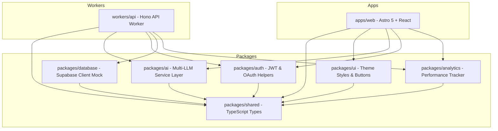

# GigPilot AI — The AI Operating System for Fiverr Freelancers

GigPilot AI is a modern SaaS platform designed to help Fiverr freelancers optimize, structure, and scale their freelance operations using an advanced modular AI engine. 

> [!IMPORTANT]  
> **Fiverr Compliance Policy:** GigPilot AI operates strictly as a content-generation and SEO-audit companion. It **never** attempts automated publishing or page manipulation, keeping all publishing decisions and copy-paste steps manually with the user to comply fully with Fiverr's Terms of Service.

---

## 🏗️ Architecture Overview

GigPilot AI uses a scalable, modular monorepo architecture powered by **npm workspaces**. 



### Monorepo Workspaces

*   **`apps/web/`**: Astro 5 frontend with React 19 interactive components, styled using Tailwind CSS and a custom Vercel-like premium glassmorphic UI.
*   **`workers/api/`**: Secure, edge-compatible REST API built with Hono and running on Cloudflare Workers / Node server adapters.
*   **`packages/shared/`**: Common TypeScript schemas and interfaces mapping API request/response envelopes.
*   **`packages/ai/`**: Provider-agnostic LLM interface supporting OpenAI, Google Gemini, Anthropic Claude, Groq, and OpenRouter. Features reliable simulation fallbacks.
*   **`packages/auth/`**: JWT session utilities, Google OAuth URL generation, and role authorization helpers (Free, Pro, Agency, Admin).
*   **`packages/database/`**: Supabase PostgreSQL connection bindings and RLS migrations.
*   **`packages/analytics/`**: Tracks credit consumption, words generated, and time saved metrics.
*   **`packages/ui/`**: Common styles, utility classes, and glassmorphic UI layout primitives.

---

## 🚀 Quick Start Guide

### Prerequisites

Ensure you have **Node.js (>= 22.12.0)** and **npm (>= 11.0.0)** installed.

### 1. Installation

From the root of the workspace, run:
```bash
npm install
```

### 2. Environment Configuration

Copy the example environment file and configure variables:
```bash
cp .env.example .env
```
*Note: If no AI API keys are configured, the platform operates seamlessly using simulated LLM responders.*

### 3. Local Development

Start the frontend and backend servers concurrently:
```bash
# Starts Astro frontend (port 4321/4322) & Hono API (port 3000)
npm run dev
npm run dev:api
```

---

## 🛠️ Project Configurations & Tool Commands

| Command | Action |
| :--- | :--- |
| `npm run dev` | Runs the Astro web development server in the background |
| `npm run dev:api` | Runs the Node Hono API backend server |
| `npm run build` | Compiles the Astro site assets and TypeScript packages |
| `npm test` | Runs the test suites using Node's native test runner (`--import tsx`) |
| `npm run lint` | Assures clean source styling |

---

## 🧪 Testing

We use the built-in Node.js test runner with `tsx` to test our packages. 

Run all tests:
```bash
npm test
```

Our test suite covers:
1.  **AI Service Abstraction (`packages/ai`)**: Resolver mappings for OpenAI, Gemini, and Groq, plus prompt compilation audits.
2.  **Auth Utilities (`packages/auth`)**: JWT generation, decoding, validity verification, and role permissions checks.
3.  **API Integration (`workers/api`)**: End-to-end endpoint validations for `/api/health`, `/api/auth/login`, and `/api/gig/generate`.

---

## 🐳 Docker Container Support

You can run the entire monorepo locally inside Docker containers.

```bash
# Build and run containers
docker-compose up --build

# Run in background
docker-compose up -d
```

Services exposed:
*   **Web Frontend**: `http://localhost:4321`
*   **Backend API**: `http://localhost:3000`

---

## 📡 API Documentation

### 1. Health Checks
*   **Endpoint**: `GET /api/health`
*   **Response**:
    ```json
    {
      "status": "online",
      "system": "GigPilot AI Operating System API Worker",
      "version": "1.0.0-production"
    }
    ```

### 2. Authentication Login
*   **Endpoint**: `POST /api/auth/login`
*   **Payload**: `{ "email": "user@example.com", "password": "securepassword" }`
*   **Response**: Returns user metadata and JWT session token.

### 3. AI Gig Generator
*   **Endpoint**: `POST /api/gig/generate`
*   **Payload**:
    ```json
    {
      "category": "Programming & Tech",
      "subcategory": "Web Development",
      "service": "Next.js Web App Design",
      "experience": "Expert",
      "tone": "Persuasive"
    }
    ```
*   **Response**: Returns structured SEO title, description copy, basic/standard/premium packages, FAQs, requirements checklist, search tags, image prompts, and upsells.

---

## 🛡️ Database & Security Rules

*   **Supabase PostgreSQL**: Configured under `packages/database/migrations`.
*   **Row Level Security (RLS)**: Enabled across all 15 tables (`users`, `subscriptions`, `generations`, `gigs`, `history`, `favorites`, etc.).
*   **Sample Policy**:
    ```sql
    CREATE POLICY "Users can access their own generations" 
    ON public.generations FOR ALL USING (auth.uid() = user_id);
    ```

---

## 🤝 Contribution Guidelines

1.  **Workspaces**: Keep domain logic separated inside correct packages (e.g. LLM alterations in `packages/ai`, styles in `packages/ui`).
2.  **Testing**: Write accompanying tests in the corresponding package `test/` directory before proposing pull requests.
3.  **ToS Safety**: Under no circumstances should automation scripts simulate direct publishing clicks on fiverr.com.
