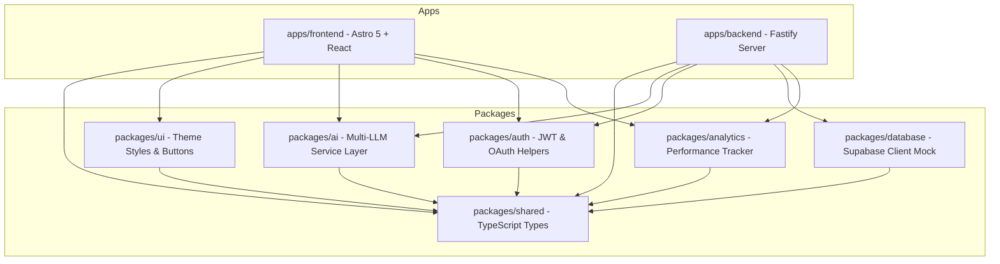

# GigPilot AI — The AI Operating System for Fiverr Freelancers

GigPilot AI is a modern SaaS platform designed to help Fiverr freelancers optimize, structure, and scale their freelance operations using an advanced modular AI engine. 

> [!IMPORTANT]  
> **Fiverr Compliance Policy:** GigPilot AI operates strictly as a content-generation and SEO-audit companion. It **never** attempts automated publishing or page manipulation, keeping all publishing decisions and copy-paste steps manually with the user to comply fully with Fiverr's Terms of Service.

---

## 🏗️ Architecture Overview

GigPilot AI uses a scalable, modular Clean Architecture monorepo powered by **npm workspaces**. The backend has been completely refactored from Hono into a production-grade **Fastify** server using clean layered patterns.



### Monorepo Workspaces

*   **`apps/frontend/`**: Astro 5 frontend with React 19 interactive components, styled using Tailwind CSS. Deployed to **Cloudflare Workers** (via `@astrojs/cloudflare`).
*   **`apps/backend/`**: Secure, production-grade REST API built with Fastify, deployed to **Render** web services. Redirection is handled via `src/index.ts -> src/server.ts` for script compatibility.
*   **`packages/shared/`**: Common TypeScript schemas and interfaces mapping API request/response envelopes.
*   **`packages/ai/`**: Provider-agnostic LLM interface supporting OpenAI, Google Gemini, Anthropic Claude, Groq, and OpenRouter.
*   **`packages/auth/`**: JWT session utilities, Google OAuth URL generation, and role authorization helpers (Free, Pro, Agency, Admin).
*   **`packages/database/`**: Supabase PostgreSQL connection bindings and RLS migrations.
*   **`packages/analytics/`**: Tracks credit consumption, words generated, and time saved metrics.
*   **`packages/ui/`**: Common styles, utility classes, and glassmorphic UI layout primitives.

### 📚 Project Documentation Guides

Detailed manuals for the new backend can be found in the [docs](./docs) folder:
*   [Architecture Documentation](./docs/ARCHITECTURE.md) - Layered structure, database caching, and queue design.
*   [API Documentation](./docs/API_DOCUMENTATION.md) - Envelopes, endpoints, validation, headers.
*   [Deployment Guide](./docs/DEPLOYMENT_GUIDE.md) - Step-by-step staging setup for Supabase, Render, Cloudflare, and Upstash.
*   [Environment Setup Guide](./docs/ENVIRONMENT_SETUP.md) - Variable schemas, validation rules, local development variables.
*   [Folder Documentation](./docs/FOLDER_DOCUMENTATION.md) - Directory layout mapping.
*   [Developer Guide](./docs/DEVELOPER_GUIDE.md) - Extension rules, feature addition walkthroughs, and testing.

---

## 🚀 Quick Start Guide

### Prerequisites

Ensure you have **Node.js (>= 22.12.0)** and **npm (>= 11.0.0)** installed.

### 1. Installation

From the root of the workspace, run:
```bash
npm install
```

### 2. Environment Configuration

Copy the example environment file and configure variables:
```bash
cp .env.example .env
```
### 3. Local Development

Start the frontend and backend servers concurrently:
```bash
# Starts Astro frontend (port 4321) & Fastify API (port 3000)
npm run dev
npm run dev:api
```

---

## 🛠️ Project Configurations & Tool Commands

| Command | Action |
| :--- | :--- |
| `npm run dev` | Runs the Astro web development server in the background |
| `npm run dev:api` | Runs the Fastify API backend server |
| `npm run build` | Compiles the Astro site assets and TypeScript packages |
| `npm test` | Runs the test suites using Node's native test runner (`--import tsx`) |
| `npm run lint` | Assures clean source styling |

---

## 🧪 Testing

We use the built-in Node.js test runner with `tsx` to test our packages and backend server. 

Run all tests:
```bash
npm test
```

Our test suite covers:
1.  **AI Service Abstraction (`packages/ai`)**: Resolver mappings for OpenAI, Gemini, and Groq, plus prompt compilation audits.
2.  **Auth Utilities (`packages/auth`)**: JWT generation, decoding, validity verification, and role permissions checks.
3.  **API Integration (`apps/backend`)**: End-to-end integration validations for `/api/health`, `/api/auth/login`, and `/api/gig/generate` using Fastify mock request injection.

---

## 🚀 Cloudflare Workers & Render Deployment

This project is configured to run serverless on Cloudflare Workers for the frontend, and as a Node.js web service on Render for the backend.

### 1. Frontend (Cloudflare Workers / Pages)

The frontend uses Astro's `@astrojs/cloudflare` adapter. To deploy it:

```bash
# Build the frontend project
npm run build --workspace=@gigpilot/frontend

# Deploy via Wrangler (Cloudflare CLI)
npx wrangler pages deploy apps/frontend/dist
```

Make sure to configure the `PUBLIC_API_URL` environment variable in your Cloudflare Pages dashboard pointing to your backend URL on Render.

### 2. Backend (Render)

The backend is built with Fastify. To deploy it on Render:
1. Create a new **Web Service** on Render.
2. Select your repository.
3. Configure the following build settings:
   - **Root Directory**: `apps/backend`
   - **Build Command**: `npm install && npm run build`
   - **Start Command**: `npm start`
4. Add your Environment Variables (e.g. `PORT`, `SUPABASE_URL`, `SUPABASE_ANON_KEY`, `JWT_SECRET`, etc.).

---

## 📡 API Documentation

For the complete API references, payloads, and envelopes, see the [API Documentation Guide](./docs/API_DOCUMENTATION.md).

---

## 🛡️ Database & Security Rules

*   **Supabase PostgreSQL**: Table migrations and security rules are configured in [supabase_schema.sql](./apps/backend/supabase_schema.sql).
*   **Row Level Security (RLS)**: Enabled across all 13 tables (`profiles`, `projects`, `gigs`, `social_accounts`, etc.) to enforce strict user tenant isolation.

---

## 🤝 Contribution Guidelines

1.  **Workspaces**: Keep domain logic separated inside correct packages (e.g. LLM alterations in `packages/ai`, styles in `packages/ui`).
2.  **Clean Architecture**: Always preserve clean architecture boundaries (Controllers -> Services -> Repositories). Never query database layers directly from controllers.
3.  **Testing**: Write accompanying integration tests under `apps/backend/test/` before proposing modifications.

