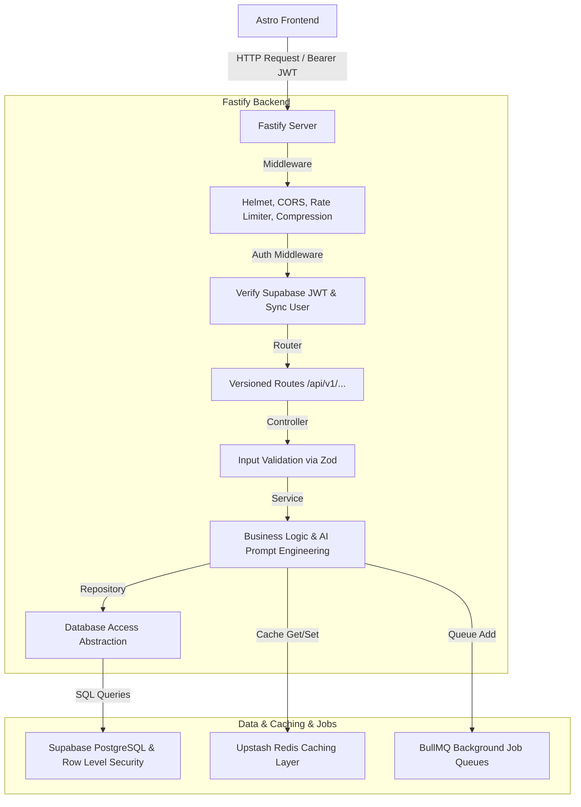

# GigPilot AI SaaS Architecture

This document describes the production-grade Clean Architecture and design system of the transformed GigPilot AI SaaS backend.

## Architecture Diagram

## Layered Clean Architecture

We implement Clean Architecture principles by separating concerns into distinct, fully-typed layers:

### 1. Routes Layer (`src/routes/`)
Maps HTTP requests (endpoints and verbs) directly to the corresponding controller methods. Routes do not contain any business logic or direct controller actions; they serve strictly as configuration. In addition, routes are versioned under `/api/v1/...` while registering compatibility aliases for legacy endpoints to keep the frontend running out-of-the-box.

### 2. Controllers Layer (`src/controllers/`)
Controllers receive the Fastify request and reply objects. They perform two tasks:
1. Validate query parameters, URL path parameters, and request body payloads using **Zod** validation schemas.
2. Delegate business logic execution to the appropriate service class and format the output into a standardized JSON response:
   - **Success Envelope:** `{ success: true, message: "string", data: {} }`
   - **Error Envelope:** `{ success: false, message: "string", error: {} }`

### 3. Services Layer (`src/services/`)
Services contain all core business logic, including:
- prompt construction and calls to LLMs (Gemini, OpenAI).
- user credit deductions.
- triggering email dispatches.
- scheduling social posts.
- caching decisions.

### 4. Repositories Layer (`src/repositories/`)
Repositories abstract all direct database queries. They use **Dependency Inversion** to allow the backend to operate in two modes:
1. **Supabase Mode:** Directly executes SQL queries against the remote PostgreSQL database using the user's auth token (fully enforcing **Row Level Security** at the database engine level).
2. **Local Fallback Mode:** Operates on the local JSON file database client when Supabase credentials are not supplied. This prevents developer setup blockers.

---

## Database Design & Row Level Security (RLS)

The database schema utilizes **Supabase PostgreSQL** with Row Level Security (RLS) enabled on every table. RLS ensures strict tenant isolation—a user can only select, insert, update, or delete records where the `user_id` matches their own verified Supabase Auth user ID (`auth.uid()`).

For full details on the tables, indexes, and security policies, see [supabase_schema.sql](../apps/backend/supabase_schema.sql).

---

## Caching Strategy

The caching system is powered by **Upstash Redis** (accessible via standard HTTP REST or Redis TCP protocols). Caching is automatically applied to:
- User dashboard analytics (invalidated on credit deduction/billing upgrades).
- AI prompt generations (for frequently used outputs).
- User and Social Hub settings.

If no `REDIS_URL` is present in the environment variables, the system automatically falls back to an in-memory TTL cache to maintain local developer velocity.

---

## Background Processing & Queue Workers

Asynchronous background processes (such as social posting retry loops, weekly analytics reports, and cleanup tasks) are handled by a modular **BullMQ** wrapper.
- **AI Generation Queue:** Deducts credits and tracks user usage metrics asynchronously.
- **Email Queue:** Dispatches transactional email alerts and magic links.
- **Scheduled Social Posts Queue:** Processes scheduler runs and manages posting retry queues.
- **Cleanup Queue:** Purges soft-deleted records.
